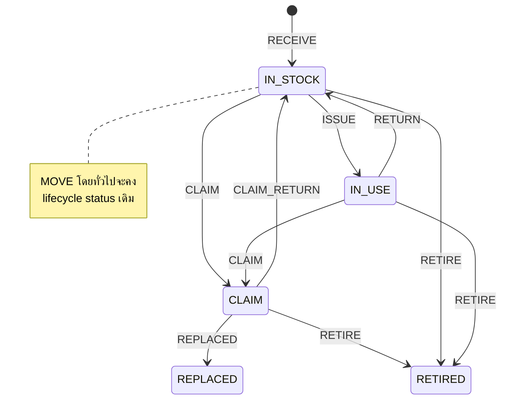
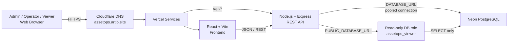

# AssetOps — ระบบจัดการวงจรชีวิตอุปกรณ์ IT

[](https://assetops.artip.site)
[](#เทคโนโลยีที่ใช้)
[](#เทคโนโลยีที่ใช้)
[](#เทคโนโลยีที่ใช้)
[](#production-deployment)
[](#production-deployment)

**AssetOps** คือระบบจัดการอุปกรณ์ IT ที่ออกแบบโดยมองทั้งวงจรชีวิตของ Asset ตั้งแต่รับเข้า จ่ายออก คืน ย้าย เคลม เปลี่ยน และปลดระวาง พร้อมระบบสิทธิ์ผู้ใช้ ประวัติการเคลื่อนไหว การควบคุมสถานะ และการ deploy ใช้งานจริงบน Production

**Production:** https://assetops.artip.site  
ระบบต้องเข้าสู่ระบบก่อนใช้งาน และไม่ได้เผยแพร่ Demo/Admin credentials ไว้ใน repository

> จุดเด่นของโปรเจกต์นี้คือการออกแบบ workflow, state transition, data integrity, transaction, RBAC, deployment และ QA ไม่ใช่แค่ CRUD ทั่วไป

---

## ที่มาของโปรเจกต์

การเก็บข้อมูลอุปกรณ์ด้วย Spreadsheet อาจเพียงพอในช่วงที่ข้อมูลยังไม่ซับซ้อน แต่เมื่อ Asset เริ่มมีการ:

- แจกให้ผู้ใช้งาน
- คืนอุปกรณ์
- ย้ายสถานที่
- ส่งเคลม
- รับกลับจากเคลม
- เปลี่ยนอุปกรณ์
- ปลดระวาง
- Import จำนวนมาก
- ตรวจสอบย้อนหลังว่า Asset เคยผ่านอะไรมาแล้วบ้าง

การแก้ค่า `status` ตรง ๆ จะเริ่มมีความเสี่ยงต่อความถูกต้องของข้อมูล

AssetOps จึงออกแบบให้การเปลี่ยนสถานะเกิดผ่าน **Operation ที่กำหนดกฎไว้ชัดเจน** เพื่อให้ Current State และ Historical Data สอดคล้องกัน

---

## ความสามารถหลัก

- ติดตาม Asset ระดับ Serial Number
- จัดการ Product และ Location
- จัดการวงจรชีวิต Asset ผ่าน Operation
- รองรับ Bulk Operation แบบ transaction เดียว
- Scanner ช่วยอ่านข้อมูล แต่ไม่ commit อัตโนมัติ
- CSV Intake พร้อม strict header validation
- สร้างหรือเปิดใช้งาน Location เดิมอัตโนมัติเมื่อ Import CSV ที่ถูกต้อง
- ลบ Product / Location โดยไม่ทำลายประวัติเดิม
- ระบบผู้ใช้และสิทธิ์ Admin / Operator / Viewer
- Session-based authentication ผ่าน HttpOnly cookie
- Public read-only API ที่สามารถใช้ Database Role แยกแบบ SELECT-only
- Production deployment บน Vercel + Neon PostgreSQL
- Custom domain ผ่าน Cloudflare DNS

---

## Asset Lifecycle

สถานะหลักของ Asset:

```text
IN_STOCK
IN_USE
CLAIM
REPLACED
RETIRED
```

Operation หลัก:

```text
RECEIVE
ISSUE
RETURN
MOVE
CLAIM
CLAIM_RETURN
REPLACED
RETIRE
```

Flow ตัวอย่าง:



Backend เป็นผู้บังคับใช้กฎการเปลี่ยนสถานะ ไม่ได้เปิดให้ UI แก้ `status` โดยตรงตามอำเภอใจ

---

## Architecture



รายละเอียดเพิ่มเติม: [`docs/ARCHITECTURE.md`](docs/ARCHITECTURE.md)

---

## การออกแบบ Data Integrity

### 1. Bulk Operation เป็น Atomic Transaction

Bulk Operation ถูกออกแบบให้เป็นงานเดียวกันทั้งชุด:

1. lock / re-read row ที่เกี่ยวข้อง
2. validate Asset ทุกตัว
3. ถ้ามีตัวใดไม่ผ่าน ให้ยกเลิกทั้ง Operation
4. commit เมื่อทุกตัวผ่านเท่านั้น

ตัวอย่าง:

```text
เลือก 10 Assets เพื่อ ISSUE
9 ตัว valid
1 ตัว invalid
```

ผลลัพธ์ที่ต้องการคือ:

```text
0 ตัวถูกเปลี่ยนสถานะ
Operation ทั้งชุดถูก rollback
```

ไม่ใช่ปล่อยให้ 9 ตัวสำเร็จและ 1 ตัวล้มเหลว

---

### 2. ลบข้อมูลโดยไม่ทำลายประวัติ

ใน UI ผู้ใช้เห็น mental model ง่าย ๆ คือ:

```text
แก้ไข
ลบ
```

แต่ backend แยกกรณี:

- Product / Location ยังไม่เคยถูกใช้งาน → Hard Delete ได้
- Product / Location เคยถูกอ้างอิงแล้ว → เปลี่ยนเป็น inactive / hidden แทน

ทำให้ผู้ใช้รู้สึกว่า "ลบ" ได้ตามปกติ แต่ระบบยังรักษา Historical Integrity เอาไว้

---

### 3. ISSUE และ RETURN เชื่อมโยงกัน

ระบบเก็บความสัมพันธ์กับ Issue Operation ปัจจุบันไว้ เพื่อให้ Return สามารถย้อนกลับไปหา Issue ที่เกี่ยวข้องได้

นอกจากนี้:

```text
RETURN
CLAIM_RETURN
```

ถูกเก็บเป็นคนละ business event ไม่ถูกรวมเป็นสถานะเดียวแบบกำกวม

---

## CSV Intake

CSV schema อย่างเป็นทางการ:

```text
SerialNumber,ModelName,Brand,PartNumber,Category,Location,ReceivedDate,ReceivedBy,Distributor,WarrantyStart,WarrantyEnd,Note
```

ระบบใช้ exact-header validation ก่อน Preview / Import และไม่เดาหรือ remap column แบบอัตโนมัติ

หาก Location:

- ยังไม่มี → สร้างใหม่
- มีอยู่แต่ inactive → เปิดใช้งานกลับมา
- มีอยู่แล้ว → ใช้รายการเดิม

---

## Role-Based Access Control

| Role | สิทธิ์โดยทั่วไป |
|---|---|
| **Admin** | จัดการระบบ ผู้ใช้ Master Data และ Operation |
| **Operator** | ทำงานด้าน Inventory / Operation ตามสิทธิ์ที่กำหนด |
| **Viewer** | อ่านข้อมูลอย่างเดียว |

สำหรับผู้ใช้ที่ต้องการเพียงดูข้อมูล สามารถสร้าง Account ด้วย Role `Viewer` แล้วใช้งานผ่าน Production URL เดียวกันได้

Backend ยังมี public read model ซึ่งสามารถเชื่อมผ่าน PostgreSQL login แยกที่ให้เฉพาะ `SELECT`

---

## เทคโนโลยีที่ใช้

| Layer | Technology |
|---|---|
| Frontend | React, Vite |
| Backend | Node.js, Express |
| Database | PostgreSQL |
| Production Database | Neon PostgreSQL |
| Production Hosting | Vercel Services |
| DNS | Cloudflare |
| Authentication | Server-side Session + HttpOnly Cookie |
| Styling | Custom Responsive CSS |
| Local Development | Node.js + PostgreSQL / Docker-supported workflow |

---

## Production Deployment

Production architecture:

```text
assetops.artip.site
        |
        v
   Vercel Services
    /          \
frontend      /api/*
React/Vite    Express
                 |
                 v
          Neon PostgreSQL
```

Environment Variables ที่ใช้:

```text
DATABASE_URL
PUBLIC_DATABASE_URL
NODE_ENV=production
ASSETOPS_TRUST_PROXY=1
ASSETOPS_SECURE_COOKIES=1
```

Secrets เก็บไว้ใน Vercel และไม่ commit ลง Git

รายละเอียด deployment: [`docs/DEPLOYMENT.md`](docs/DEPLOYMENT.md)

---

## Production QA

Production Smoke Test ล่าสุด:

```text
PASS P01  /api/health -> 200
PASS P02  anonymous /api/auth/me -> 401
PASS P03  SPA root -> 200
PASS P04  SPA deep link /products -> 200
PASS P05  public viewer API -> 200

PASS A01  admin login -> 200
PASS A02  account -> 200
PASS A03  products -> 200
PASS A04  inventory -> 200
PASS A05  operations -> 200

RESULT: PASS
```

Production SPA routing baseline:

```text
3159193  Fix SPA routing inside Vercel frontend service
```

รายละเอียด QA: [`docs/QA.md`](docs/QA.md)

---

## Screenshots

ก่อนนำภาพไปใส่ใน Public Repository ควรใช้ **Demo/Test Data เท่านั้น**

ห้ามเผยแพร่:

- Serial Number จริง
- ชื่อพนักงานจริง
- Email ภายใน
- Password
- Database URL
- Session Cookie
- Connection String
- ข้อมูล Inventory ที่เป็นความลับของบริษัท

ดูรายการภาพที่แนะนำ: [`docs/SCREENSHOTS.md`](docs/SCREENSHOTS.md)

<!--
หลังจากมี sanitized screenshots แล้ว uncomment ส่วนนี้

### Dashboard


### Inventory


### Asset Detail


### Operations


### CSV Intake

-->

---

## Local Development

Backend:

```bash
cd backend
npm install
npm run dev
```

Frontend:

```bash
cd frontend
npm install
npm run dev
```

Frontend ใช้ relative API path:

```text
/api/...
```

จึงสามารถใช้ API contract เดียวกันได้ทั้ง Local และ Production

---

## จุดเด่นด้าน Engineering

โปรเจกต์นี้แสดงแนวคิดที่มากกว่า CRUD เช่น:

- State-machine thinking
- Transaction-safe bulk mutation
- Data integrity
- RBAC
- Session security
- History-preserving delete
- Strict CSV contract
- Scanner-assisted workflow
- Read-only database separation
- PostgreSQL migration / restore
- Multi-service deployment
- SPA routing
- Production smoke test
- Regression QA

---

## โครงสร้าง Repository

```text
backend/                 Express API, Auth, Operations, Public read model
frontend/                React/Vite Manager UI
viewer/                  Optional standalone Public Viewer
database/migrations/     Database schema evolution
deployment/              Deployment / Production support files
vercel.json              Vercel Services configuration
```

---

## สิ่งที่สามารถพัฒนาต่อ

- แยก frontend bundle ด้วย route-level / dynamic import
- เพิ่ม CI สำหรับ integration / regression test
- เพิ่ม monitoring และ alerting
- เพิ่ม automated backup verification
- เพิ่ม sanitized demo seed data
- เพิ่ม automated portfolio screenshots

---

## Portfolio Case Study

เวอร์ชันสรุปสำหรับใช้คุยในการสัมภาษณ์และ Resume อยู่ที่:

[`docs/PORTFOLIO.md`](docs/PORTFOLIO.md)
