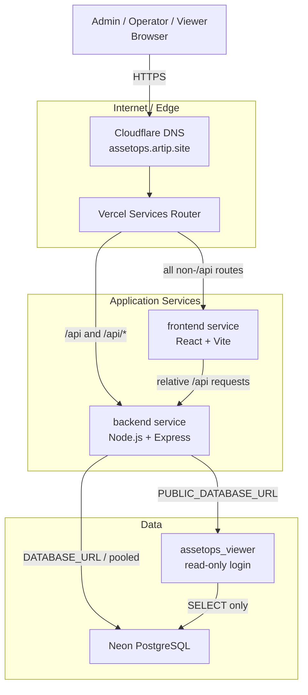

# Architecture

## Production topology



## Service responsibilities

### Frontend

The Manager UI is a React/Vite single-page application.

The production router must preserve SPA deep links. `/products`, `/inventory/...`, and other client routes are routed to the frontend service and resolved through `/index.html`, after which React Router handles the route.

### Backend

Express owns:

- authentication/session endpoints,
- Manager APIs,
- lifecycle operations,
- Product/Location/Project management,
- CSV intake validation/import,
- public read-only endpoints.

Manager APIs are protected behind the authentication/authorization boundary.

### PostgreSQL

The relational model preserves both current state and operation history.

Important integrity concepts include:

- explicit asset status,
- operation/movement records,
- current issue linkage,
- source-operation linkage,
- referenced master-data preservation,
- database transactions for multi-asset mutation.

## Request routing

```text
GET /login
GET /products
GET /inventory/123
        |
        v
frontend service -> /index.html -> React Router

GET/POST /api/...
        |
        v
backend service -> Express -> PostgreSQL
```

## Read-only public data path

The repository contains a public read model and public API.

Production database access for that path is configured through a separate PostgreSQL role with only the privileges required to read the viewer schema. It is not given Product UPDATE privilege.

The current production UX uses authenticated Viewer accounts instead of deploying the optional standalone Viewer UI.
